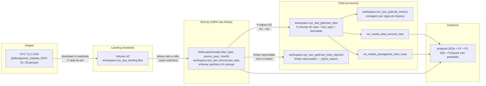
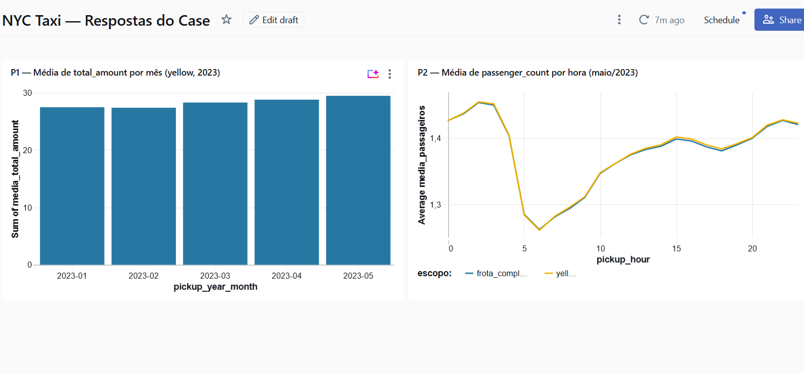

<div align="center">

# 🚖 ifood-case - Data Architect

### Data Lake em arquitetura medalhão para 16,5 milhões de corridas de táxi de NY

**NYC TLC Trip Records · Janeiro-Maio/2023 · yellow + green**


[Arquitetura](#arquitetura) •
[Como executar](#como-executar) •
[Resultados](#resultados-e-interpretação) •
[Justificativas](#justificativas-técnicas) •
[Dashboard](#extra--dashboard)

</div>

---

## Visão geral

Os 10 arquivos Parquet originais da NYC TLC (yellow e green, janeiro a maio de
2023, somando 16.526.016 corridas) são ingeridos **imutáveis** em um Volume do Unity
Catalog (landing), unificados em uma tabela Delta com schema canônico e sem
nenhum filtro (bronze) e, só então, limpos com **4 regras explícitas de
qualidade** (cada uma com contagem persistida e reconciliação exata) na
camada de consumo (gold), que expõe as 5 colunas obrigatórias do case e views
SQL prontas. PySpark é usado em todas as transformações; as respostas são
calculadas de forma independente em SQL e PySpark, com paridade verificada.

> [!IMPORTANT]
> **Respostas do case** (detalhes em [Resultados e interpretação](#resultados-e-interpretação)):
>
> - **P1 - média de `total_amount` por mês (yellow)**: Jan **US$ 27,46** ·
>   Fev **27,37** · Mar **28,28** · Abr **28,78** · Mai **29,45** por corrida.
> - **P2 - média de `passenger_count` por hora em maio/2023**: varia de
>   **~1,26** (6h) a **~1,45** (2h) passageiros/corrida, praticamente idêntica
>   entre a frota completa (yellow+green) e só yellow; a demanda absoluta de
>   passageiros, por outro lado, tem **pico às 18h**.

<div align="center">

| 🚕 16.526.016 corridas | ✅ 94,71% aproveitamento | 🔍 reconciliação exata (dif. 0) | 🧪 51 testes | ⚙️ pipeline em 1 comando |
|:---:|:---:|:---:|:---:|:---:|

</div>

## Arquitetura



<details>
<summary>Diagrama em ASCII (fallback)</summary>

```text
NYC TLC CDN                LANDING                      BRONZE                        GOLD (consumo)
{yellow|green}_tripdata    Volume UC                    Delta unificada               Delta limpa
_2023-01..05.parquet  -->  workspace.nyc_taxi_landing   workspace.nyc_taxi_bronze --> workspace.nyc_taxi_gold
(10 arquivos, imutáveis)   .files                       .taxi_trips                   .taxi_trips (5 colunas do case
                           parquets ORIGINAIS           24 colunas canônicas,         + taxi_type + derivadas)
                                                        yellow+green, SEM filtro,     + dq_metrics (DQ por regra)
                                                        partição (taxi_type,          + taxi_trips_rejected (linhas
                                                        source_year_month)              reprovadas + _reject_reason)
                                                                                      + vw_media_total_amount_mes
                                                                                      + vw_media_passageiros_hora_maio
                                                                                                |
                                                                                                v
                                                                                      analysis/ (EDA + P1 + P2)
```

</details>

Regras da arquitetura: a landing preserva os arquivos exatamente como
baixados; a bronze unifica yellow+green num schema canônico com casts
explícitos **sem descartar nenhuma linha**; toda limpeza acontece na gold, com
regras explícitas e contagem por regra persistida em `dq_metrics`
(reconciliação obrigatória: `linhas_bronze == linhas_gold + soma(removidas)`).
As linhas reprovadas **não são descartadas**: vão para a quarentena
`taxi_trips_rejected` com o motivo em `_reject_reason`, de modo que gold e
quarentena são complementares e disjuntas - juntas reconstituem a bronze, e
qualquer corrida removida é auditável linha a linha.

### Por que não há camada silver

O medalhão canônico tem três camadas, e aqui a silver foi deliberadamente
omitida: **o trabalho que normalmente caberia a ela já está distribuído entre
as camadas vizinhas**, e uma silver intermediária seria uma cópia da bronze
sem transformação própria.

| Responsabilidade típica da silver | Onde está neste projeto |
|---|---|
| Conformar schemas divergentes (drift 2023-01 × 2023-02..05) | Bronze - leitura mês a mês com casts explícitos |
| Unificar fontes (yellow + green) | Bronze -`unionByName` sobre o schema canônico de 24 colunas |
| Padronizar nomes (`lpep_*`→`tpep_*`, `Airport_fee`→`airport_fee`) | Bronze |
| Linhagem (`taxi_type`, `source_year_month`, `ingested_at`) | Bronze |
| Limpeza e regras de qualidade | Gold -R1→R4 com contagem por regra em `dq_metrics` |
| Derivadas de negócio (`pickup_year_month`, `pickup_hour`) | Gold |

Note que a bronze **não é um espelho cru da origem**: o "raw as-is" está na
landing, com os parquets originais imutáveis. São, na prática, quatro camadas
físicas - landing (bruta) → bronze (conformada) → gold (limpa) → views. Dois
fatores reforçam a escolha: o volume é pequeno (16,5M linhas, <1 GB, build em
minutos), então materializar um estágio extra não se paga; e há **um único
consumidor** - uma gold servindo duas perguntas.

Vale separar arquitetura de rótulo. A camada de limpeza **existe** e é uma
etapa própria, com regras versionadas e contagem por regra - aqui ela se chama
gold. É comum ver exatamente este mesmo desenho (landing bruta → camada
conformada → camada limpa consumida por SQL) com a camada final rotulada como
silver; a diferença nesse caso é de nomenclatura, não de pipeline. A escolha
do nome `gold` segue a semântica do enunciado: é dela que sai a **camada de
consumo com as 5 colunas obrigatórias**.

**Quando a silver entraria:** com FHV/FHVHV no escopo, dimensões
(`taxi_zone_lookup`) para enriquecer as corridas, ou várias marts (financeira,
operacional, geográfica) sobre a mesma base. Aí a limpeza sairia da gold e
passaria a ser aplicada uma única vez na silver, evitando que cada mart
reescrevesse as mesmas regras de negócio - que é exatamente a dívida consciente
assumida hoje.

## Estrutura do repositório

```text
ifood-case/
├── src/                          # código-fonte da solução
│   ├── ingestion/tlc_source.py   # lógica pura da origem (URL, caminho, integridade)
│   ├── ingestion/ingestao_landing.py # notebook: origem → Volume da landing
│   ├── ingestion/download_tlc.py # download local idempotente (alternativa)
│   ├── bronze/schema_canonico.py # schema canônico (Python puro, testável)
│   ├── bronze/bronze_taxi_trips.py  # notebook Databricks da bronze
│   ├── gold/build_gold.py        # regras de DQ e transformações da gold
│   ├── gold/gold_taxi_trips.py   # notebook da gold + dq_metrics + quarentena
│   ├── gold/criar_views.py       # notebook que cria as views (task do job)
│   └── gold/sql/create_views.sql # views SQL das 2 perguntas
├── analysis/                     # análises do case
│   ├── 01_eda_nyc_taxi.py        # EDA (volumetria, anomalias, impacto da limpeza)
│   ├── 02_resposta_p1_media_total_amount_mes.py
│   ├── 03_resposta_p2_media_passageiros_hora_maio.py
│   └── sql/                      # consultas prontas para o SQL Warehouse
├── docs/DATA_CONTRACT.md         # contrato da camada de consumo (schema, garantias, mudanças)
├── docs/ESCALABILIDADE.md        # gatilhos de evolução da arquitetura em produção
├── docs/manual_steps/            # guias passo a passo (modelo de execução manual)
├── scripts/                      # utilitários de setup/execução (.ps1 e .sh)
├── tests/                        # pytest (schema canônico, regras de DQ)
├── databricks.yml                # Asset Bundle (deploy/execução automatizados)
├── resources/catalogo.yml        # schemas do medalhão e Volume da landing
├── resources/pipeline_job.yml    # job do pipeline como código (7 tasks)
├── README.md
├── requirements.txt              # dependências pinadas
└── pyproject.toml                # config de ruff, black e pytest
```

## Pré-requisitos

- Conta **Databricks Free Edition** (gratuita; serverless-only, Unity Catalog)
- **Python 3.12 ou 3.13** para reprodução local (o pyspark 4.x **não suporta
  Python 3.14**; testes com Spark local exigem também Java 17+)
- **git**
- **Databricks CLI v1.11.0** (versão usada e validada neste projeto) - binário
  standalone, **não é pacote pip**. Necessária para as ações `landing` e
  `deploy` dos scripts e para o Asset Bundle; dispensável se você executar tudo
  pela UI do workspace, seguindo os guias de `docs/manual_steps/`.

  ```powershell
  winget install Databricks.DatabricksCLI   # Windows
  brew install databricks/tap/databricks    # macOS
  databricks version                        # confira: Databricks CLI v1.11.0
  ```

  (alternativa: binários em https://github.com/databricks/cli/releases)
- Dependências locais: `pip install -r requirements.txt`

## Como executar

### ⚡ Início rápido (scripts utilitários)

A pasta [scripts/](scripts/) concentra as ações locais do projeto em um único
comando por tarefa - Windows (`.ps1`) e macOS/Linux (`.sh`):

```powershell
.\scripts\projeto.ps1 setup      # cria a venv (Python 3.12/3.13) e instala dependências
.\scripts\projeto.ps1 dados      # baixa os 10 parquets da TLC para data/landing (idempotente)
.\scripts\projeto.ps1 qualidade  # ruff + black --check + pytest
.\scripts\projeto.ps1 landing    # cria schemas/Volume e carrega a landing da sua máquina
.\scripts\projeto.ps1 deploy     # bundle validate + deploy + run no Databricks
```

(equivalente em macOS/Linux: `./scripts/projeto.sh <ação>`)

### 📋 Passo a passo documentado

O projeto segue um modelo de **execução manual documentada**: o código e os
guias vivem no repo; as ações no workspace são executadas seguindo os guias de
`docs/manual_steps/`, na ordem abaixo.

1. **Setup do Databricks** - siga
   [docs/manual_steps/001-setup-databricks.md](docs/manual_steps/001-setup-databricks.md):
   cria os schemas e o Volume da landing. O carregamento dos 10 parquets é
   automático (item 1.1); o upload manual descrito nesse guia fica como
   alternativa para workspace sem acesso à origem.
   - **1.1 Ingestão** -
     [src/ingestion/ingestao_landing.py](src/ingestion/ingestao_landing.py)
     baixa os arquivos da origem pública direto para
     `/Volumes/workspace/nyc_taxi_landing/files/{yellow|green}/2023/`,
     validando `Content-Length` e pulando o que já está íntegro. Roda como
     primeira task do job. Passo a passo em
     [docs/manual_steps/010-ingestao-automatizada.md](docs/manual_steps/010-ingestao-automatizada.md).
     Fora do Databricks, o mesmo download é feito por
     `python src/ingestion/download_tlc.py`.
2. **Bronze** - siga
   [docs/manual_steps/002-executar-bronze.md](docs/manual_steps/002-executar-bronze.md):
   importe e execute o notebook
   [src/bronze/bronze_taxi_trips.py](src/bronze/bronze_taxi_trips.py)
   (leitura mês a mês com casts explícitos, partição por tipo e mês,
   reexecução idempotente via `replaceWhere`).
3. **Gold + views** - siga
   [docs/manual_steps/003-camada-consumo.md](docs/manual_steps/003-camada-consumo.md):
   execute [src/gold/gold_taxi_trips.py](src/gold/gold_taxi_trips.py) (aplica
   as 4 regras de DQ, grava `dq_metrics` e a quarentena `taxi_trips_rejected`,
   e valida reconciliação e particionamento com `assert`) e crie as views com
   [src/gold/sql/create_views.sql](src/gold/sql/create_views.sql). Conferência
   da quarentena em
   [docs/manual_steps/008-quarentena-dq.md](docs/manual_steps/008-quarentena-dq.md).
4. **Análises** - siga
   [docs/manual_steps/004-analises.md](docs/manual_steps/004-analises.md):
   execute os notebooks de [analysis/](analysis/) (EDA, P1, P2) e as
   consultas de [analysis/sql/](analysis/sql/) no SQL Warehouse.

### 🤖 Execução automatizada (Databricks Asset Bundles)

Substitui os passos 1.1 a 4 acima: com os schemas e o Volume criados, o
repositório traz um Asset Bundle ([databricks.yml](databricks.yml) +
[resources/pipeline_job.yml](resources/pipeline_job.yml)) que sobe os
notebooks e reproduz a solução **do zero** - incluindo o download dos dados -
com 3 comandos, em qualquer workspace:

```bash
databricks bundle validate                 # confere a configuração
databricks bundle deploy                   # sobe notebooks e cria o job
databricks bundle run pipeline_nyc_taxi   # ingestão → bronze → gold → views → análises → governança
```

As 7 tasks do job são sequenciais e idempotentes: reexecutar não rebaixa
arquivo íntegro, não duplica linha e não altera nenhum número.

> [!NOTE]
> A primeira task baixa os dados da origem pública, mas o egresso de internet
> da Free Edition é restrito a uma allowlist que varia entre workspaces. Se o
> CDN da TLC não for alcançável no seu, carregue a landing a partir da sua
> máquina com `.\scripts\projeto.ps1 landing` (ou `./scripts/projeto.sh
> landing`) e rode o pipeline em seguida: a ingestão detecta a landing íntegra
> e dispensa a rede.

Pré-requisito: Databricks CLI autenticada no workspace de destino -
passo a passo em
[docs/manual_steps/007-bundles.md](docs/manual_steps/007-bundles.md).

#### Rodar em outro workspace

São dois passos, e o segundo é obrigatório: **estar logado em algum workspace
não basta**, a credencial precisa ser do host que o bundle usa. Com o host
apontando para um workspace e o perfil para outro, o deploy falha com
`cannot configure default credentials`.

```powershell
# 1. aponte o host do target em databricks.yml (ou crie um target novo e use -t <nome>)
#      targets.dev.workspace.host: https://<id-do-workspace>.cloud.databricks.com

# 2. autentique NAQUELE host
databricks auth login --host https://<id-do-workspace>.cloud.databricks.com

# 3. confira: "status" deve ser "success" e o host vir do bundle
databricks auth describe -o json
```

Feito isso, o workspace sai do zero ao pipeline completo com
`.\scripts\projeto.ps1 deploy` - o bundle cria os schemas e o Volume, e a
primeira task baixa os dados. Se o egresso do workspace não alcançar o CDN da
TLC (ver nota acima), rode antes `.\scripts\projeto.ps1 landing`, que cria as
pastas do Volume e sobe os 10 parquets da sua máquina.

### ✅ Qualidade de código local

```bash
ruff check .        # lint
black --check .     # formatação
pytest              # testes (os 3 testes com Spark local são pulados sem Java 17+)
```

## Resultados e interpretação

Números obtidos na execução real no Databricks Free Edition (2026-08-09/10).

**Qualidade de dados** (de `workspace.nyc_taxi_gold.dq_metrics`): das
16.526.016 corridas da bronze, 15.651.177 (94,71%) chegam à gold. Removidas
por regra (cada linha conta só na primeira regra violada): pickup fora de
Jan-Mai/2023: **113** · dropoff ≤ pickup: **6.595** · `total_amount` negativo:
**142.294** · `passenger_count` nulo ou zero: **725.837**. A reconciliação
fecha com diferença **0** nos três escopos (yellow, green, total).

Essas 874.839 corridas não são descartadas: ficam em
`workspace.nyc_taxi_gold.taxi_trips_rejected` com o motivo, então a auditoria
é linha a linha, não só agregada, e `gold + quarentena` reconstitui a bronze:

```sql
SELECT VendorID, tpep_pickup_datetime, total_amount, source_year_month
FROM workspace.nyc_taxi_gold.taxi_trips_rejected
WHERE _reject_reason = 'removidas_r3_total_amount_negativo'
ORDER BY total_amount LIMIT 5;   -- menor valor da base: -982,95
```

### 💰 P1 - média de `total_amount` por mês (yellow taxis)

| mês | média (USD) | corridas | benchmark¹ | desvio |
|:---:|:---:|:---:|:---:|:---:|
| 2023-01 | **27,46** | 2.917.665 | 27,44 | +0,02 |
| 2023-02 | **27,37** | 2.764.200 | 27,33 | +0,04 |
| 2023-03 | **28,28** | 3.226.999 | 28,26 | +0,02 |
| 2023-04 | **28,78** | 3.109.876 | 28,76 | +0,02 |
| 2023-05 | **29,45** | 3.319.397 | 29,46 | −0,01 |

¹ Benchmark: convergência de soluções públicas independentes do mesmo case
(sanidade externa). Paridade SQL × PySpark: diferença 0,000 nos 5 meses.
Tendência: alta consistente de ~7% de janeiro a maio.

### 👥 P2 - média de `passenger_count` por hora do dia (maio/2023)

Respondida em **dois escopos lado a lado**: `frota_completa` (yellow + green)
e `yellow`. Extremos da ocupação média por corrida (48 valores, paridade
SQL × PySpark OK em todos):

| leitura | 📈 pico | valor | 📉 vale | valor |
|---------|:---:|:---:|:---:|:---:|
| Ocupação média por corrida (frota) | 2h | **1,454** | 6h | 1,262 |
| Ocupação média por corrida (yellow) | 2h | **1,455** | 6h | 1,261 |
| Demanda de passageiros/hora (frota) | 18h | **10.827/dia** | 4h | 728/dia |

**Interpretação do escopo** ("todos os táxis"): a frota considerada é
yellow + green, distinguida pela coluna `taxi_type` da gold. FHV/FHVHV (apps e
aluguel) ficaram **fora de escopo** porque seus arquivos não possuem a coluna
`passenger_count` - não há como incluí-los nesta média. Como o green é ~1% do
volume de maio, as séries `frota_completa` e `yellow` são quase idênticas
(diferença ≤ 0,003 em todas as horas).

> [!TIP]
> **Insight - duas leituras da mesma pergunta**: a média por corrida
> (`AVG(passenger_count)`) mede **ocupação** - madrugada tem menos corridas,
> porém mais cheias (grupos saindo de bares: pico às 2h). Já a soma de
> passageiros por hora (`SUM/31 dias`) mede **demanda**: o pico operacional
> real é às 18h (~10,8 mil passageiros/hora na frota), quando o volume de
> corridas domina. As duas leituras respondem perguntas de negócio diferentes;
> o notebook da P2 apresenta ambas.

Nuance metodológica: `AVG()` ignora NULL, então o filtro de `passenger_count`
da gold não altera a média da P2 - altera a contagem de corridas e a P1. O
corte de corridas com **zero** passageiros (registro inválido) evita puxar a
ocupação para baixo.

## Governança e contrato de dados

O catálogo se explica sozinho: **todas** as 53 colunas das camadas conformada e
de consumo têm comentário, incluindo as das views, e as tabelas carregam tags
de classificação (`camada`, `dominio`, `fonte`, `contem_pii`, `projeto`). Quem
abre o Catalog Explorer entende o dado sem precisar deste README.

Os metadados são **código versionado**, não cliques na interface:
[src/governance/catalog_metadata.sql](src/governance/catalog_metadata.sql) é
aplicado por [src/governance/aplicar_metadados.py](src/governance/aplicar_metadados.py)
como última task do job, de forma idempotente. Os comentários das views moram
na própria definição em
[create_views.sql](src/gold/sql/create_views.sql), já que `CREATE OR REPLACE`
as recria a cada execução e sobrescreveria comentários aplicados por fora.

O [contrato de dados](docs/DATA_CONTRACT.md) formaliza o que a camada de
consumo garante (grão, janela, schema, as 4 regras de qualidade com contagem),
o que ela **não** garante (sem deduplicação, outliers preservados,
`payment_type = 0` mantido) e o que caracteriza uma mudança quebrando
compatibilidade. Passo a passo em
[docs/manual_steps/009-governanca.md](docs/manual_steps/009-governanca.md).

## Justificativas técnicas

| Critério do case (PDF) | Evidência concreta neste repo |
|---|---|
|  Qualidade e organização do código | Módulos Python puros testáveis (`src/bronze/schema_canonico.py`, `src/gold/build_gold.py`) espelhados nos notebooks com teste de consistência; `ruff` + `black` + `pytest` configurados em `pyproject.toml`; 51 testes; convenção de commits e uma branch por entrega, integradas com merges `--no-ff` |
|  Análise exploratória | `analysis/01_eda_nyc_taxi.py`: volumetria validada contra a origem, 6 hipóteses de anomalia confirmadas/refutadas com contagem (nulls, datas de 2001-2008, estornos de até −982,95, `payment_type=0` correlacionado 1:1 com nulls, `RatecodeID=99`, outlier de 342 mil milhas) e impacto da limpeza quantificado |
|  Justificativa das escolhas técnicas | Decisões documentadas neste README e nos docstrings/células markdown dos notebooks. Por exemplo: leitura mês a mês por causa do **schema drift real** entre 2023-01 e 2023-02..05 (tipos e grafia `airport_fee`/`Airport_fee`); TIMESTAMP_NTZ sem conversão de fuso; limpeza só na gold com contagem por regra |
|  Criatividade | P2 respondida em dois escopos + dupla leitura ocupação × demanda; `dq_metrics` com atribuição por primeira regra violada e reconciliação exata, com quarentena `taxi_trips_rejected` tornando cada linha removida auditável; paridade SQL × PySpark como verificação cruzada; benchmarks externos de sanidade para a P1; pipeline executável com 1 comando via Asset Bundle |
|  Clareza na comunicação | Este README (arquitetura, execução, resultados com interpretação); contrato de dados e comentários em 100% das colunas do catálogo; guias passo a passo em `docs/manual_steps/`; dashboard com as respostas; notebooks com células markdown explicando cada etapa e tabelas finais de evidência |

## Limitações e próximos passos

**Limitações do ambiente/solução:**

- Databricks **Free Edition**: serverless-only, DBFS root desabilitado (por
  isso Volume UC na landing), egresso de internet dos notebooks restrito a
  allowlist não publicada **que varia entre workspaces**: no workspace onde a
  solução foi construída o CDN da origem resolve e a task de ingestão baixa os
  dados, enquanto em outro workspace da mesma edição o mesmo host não resolve,
  embora `pypi.org`, `github.com` e `s3.amazonaws.com` resolvam. Por isso a
  ingestão detecta a landing já carregada e dispensa a rede, e existe a ação
  `landing` para carregá-la a partir da sua máquina), 1 SQL Warehouse
  2X-Small.
- Orquestração via job único do Asset Bundle, **sem agendamento nem
  monitoramento de produção** (adequado ao case).
- **FHV/FHVHV fora de escopo** (sem `passenger_count`).
- Tabelas pequenas (<1 GB): sem particionamento físico na gold nem OPTIMIZE.
- Gold é uma **tabela flat** de 8 colunas - atende ao enunciado, mas não é um
  modelo dimensional.

**Próximos passos naturais** - cada um com a **condição numérica de disparo**
documentada em [docs/ESCALABILIDADE.md](docs/ESCALABILIDADE.md), que também
registra o que **não** mudaria em nenhuma escala:

- **Modelagem dimensional da gold**: fato no grão da corrida + dimensão de
  tempo e de zona (`taxi_zone_lookup`, já mapeada). É nesse cenário que a
  camada silver passa a se justificar: a limpeza sai da gold e vira estágio
  compartilhado entre as marts.
- CI (GitHub Actions) rodando lint, testes e `bundle validate` a cada push.
- Agendamento e alertas no job (Lakeflow Declarative Pipelines com
  expectations substituiria as regras manuais de DQ).
- Auto Loader com checkpoint, quando a chegada dos arquivos deixar de ser uma
  lista previsível.
- Liquid clustering em vez de partição estática, a partir de 1 TB por tabela
  (abaixo disso a recomendação da plataforma é não particionar).

## Extra - Dashboard

Entrega extra além do pedido no enunciado: um dashboard AI/BI nativo do
Databricks SQL (`NYC Taxi - Respostas do Case`) com as duas respostas
visualizadas a partir das views da gold - barras da P1 por mês e linhas da P2
por hora com as séries `frota_completa`/`yellow`.

<div align="center">



</div>

Passo a passo de criação em
[docs/manual_steps/006-dashboard.md](docs/manual_steps/006-dashboard.md).

## Referências

- NYC TLC Trip Record Data (dados e dicionários):
  <https://www.nyc.gov/site/tlc/about/tlc-trip-record-data.page> (arquivos via
  CDN <https://d37ci6vzurychx.cloudfront.net/trip-data/>)
- Databricks Free Edition - limitações:
  <https://docs.databricks.com/aws/en/getting-started/free-edition-limitations>
- Caso público Databricks × iFood (medalhão com Delta + Unity Catalog como
  prática real do iFood):
  <https://www.databricks.com/customers/ifood/lakeflow-declarative-pipelines>
- Upload para Volumes / CLI:
  <https://docs.databricks.com/aws/en/ingestion/file-upload/upload-to-volume>

---

<div align="center">

**Dados públicos NYC TLC** · **Databricks Free Edition** · **Delta Lake + Unity Catalog**

</div>
