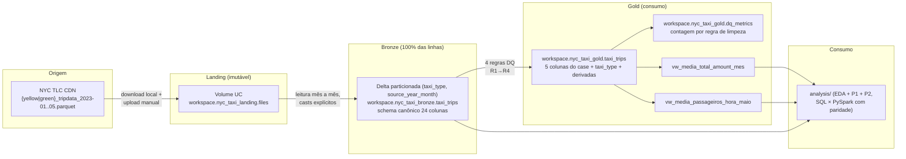

# ifood-case — Data Architect (NYC TLC Trip Records, Jan–Mai/2023)

Case técnico do processo seletivo iFood — Data Architect: Data Lake em
arquitetura medalhão no **Databricks Free Edition** com os dados públicos de
corridas de táxi de Nova York (yellow + green), disponibilizados para consumo
SQL e com as duas análises obrigatórias respondidas.

## Visão geral

Os 10 arquivos Parquet originais da NYC TLC (yellow e green, janeiro a maio de
2023 — 16.526.016 corridas) são ingeridos **imutáveis** em um Volume do Unity
Catalog (landing), unificados em uma tabela Delta com schema canônico e sem
nenhum filtro (bronze) e, só então, limpos com **4 regras explícitas de
qualidade** — cada uma com contagem persistida e reconciliação exata — na
camada de consumo (gold), que expõe as 5 colunas obrigatórias do case e views
SQL prontas. PySpark é usado em todas as transformações; as respostas são
calculadas de forma independente em SQL e PySpark, com paridade verificada.

**Respostas do case** (detalhes em [Resultados e interpretação](#resultados-e-interpretação)):

- **P1 — média de `total_amount` por mês (yellow)**: Jan **27,46** · Fev
  **27,37** · Mar **28,28** · Abr **28,78** · Mai **29,45** (USD/corrida).
- **P2 — média de `passenger_count` por hora em maio/2023**: varia de ~1,26
  (6h) a ~1,45 (2h) passageiros/corrida, praticamente idêntica entre a frota
  completa (yellow+green) e só yellow; a demanda absoluta de passageiros, por
  outro lado, tem pico às 18h.

## Arquitetura



<details>
<summary>Diagrama em ASCII (fallback)</summary>

```text
NYC TLC CDN                LANDING                      BRONZE                        GOLD (consumo)
{yellow|green}_tripdata    Volume UC                    Delta unificada               Delta limpa
_2023-01..05.parquet  -->  workspace.nyc_taxi_landing   workspace.nyc_taxi_bronze --> workspace.nyc_taxi_gold
(10 arquivos, imutáveis)   .files                       .taxi_trips                   .taxi_trips (5 colunas do case
                           parquets ORIGINAIS           24 colunas canônicas,         + taxi_type + derivadas)
                                                        yellow+green, SEM filtro,     + dq_metrics (DQ por regra)
                                                        partição (taxi_type,          + vw_media_total_amount_mes
                                                        source_year_month)            + vw_media_passageiros_hora_maio
                                                                                                |
                                                                                                v
                                                                                      analysis/ (EDA + P1 + P2)
```

</details>

Regras da arquitetura: a landing preserva os arquivos exatamente como
baixados; a bronze unifica yellow+green num schema canônico com casts
explícitos **sem descartar nenhuma linha**; toda limpeza acontece na gold, com
regras explícitas e contagem por regra persistida em `dq_metrics`
(reconciliação obrigatória: `linhas_bronze == linhas_gold + soma(removidas)`).

## Estrutura do repositório

```text
ifood-case/
├── src/                          # código-fonte da solução
│   ├── ingestion/download_tlc.py # download local idempotente dos 10 parquets
│   ├── bronze/schema_canonico.py # schema canônico (Python puro, testável)
│   ├── bronze/bronze_taxi_trips.py  # notebook Databricks da bronze
│   ├── gold/build_gold.py        # regras de DQ e transformações da gold
│   ├── gold/gold_taxi_trips.py   # notebook Databricks da gold + dq_metrics
│   ├── gold/criar_views.py       # notebook que cria as views (task do job)
│   └── gold/sql/create_views.sql # views SQL das 2 perguntas
├── analysis/                     # análises do case
│   ├── 01_eda_nyc_taxi.py        # EDA (volumetria, anomalias, impacto da limpeza)
│   ├── 02_resposta_p1_media_total_amount_mes.py
│   ├── 03_resposta_p2_media_passageiros_hora_maio.py
│   └── sql/                      # consultas prontas para o SQL Warehouse
├── docs/manual_steps/            # guias passo a passo (modelo de execução manual)
├── scripts/                      # utilitários de setup/execução (.ps1 e .sh)
├── tests/                        # pytest (schema canônico, regras de DQ)
├── databricks.yml                # Asset Bundle (deploy/execução automatizados)
├── resources/pipeline_job.yml    # job do pipeline como código (5 tasks)
├── README.md
├── requirements.txt              # dependências pinadas
└── pyproject.toml                # config de ruff, black e pytest
```

## Pré-requisitos

- Conta **Databricks Free Edition** (gratuita; serverless-only, Unity Catalog)
- **Python 3.12 ou 3.13** para reprodução local (o pyspark 4.x **não suporta
  Python 3.14**; testes com Spark local exigem também Java 17+)
- **git** e, opcionalmente, a **Databricks CLI** (binário standalone — não é
  pacote pip) para upload via terminal
- Dependências locais: `pip install -r requirements.txt`

## Como executar

### Início rápido (scripts utilitários)

A pasta [scripts/](scripts/) concentra as ações locais do projeto em um único
comando por tarefa — Windows (`.ps1`) e macOS/Linux (`.sh`):

```powershell
.\scripts\projeto.ps1 setup      # cria a venv (Python 3.12/3.13) e instala dependências
.\scripts\projeto.ps1 dados      # baixa os 10 parquets da TLC para data/landing (idempotente)
.\scripts\projeto.ps1 qualidade  # ruff + black --check + pytest
.\scripts\projeto.ps1 deploy     # bundle validate + deploy + run no Databricks
```

(equivalente em macOS/Linux: `./scripts/projeto.sh <ação>`)

O projeto segue um modelo de **execução manual documentada**: o código e os
guias vivem no repo; as ações no workspace são executadas seguindo os guias de
`docs/manual_steps/`, na ordem abaixo.

1. **Setup do Databricks + landing** — siga
   [docs/manual_steps/001-setup-databricks.md](docs/manual_steps/001-setup-databricks.md):
   cria os schemas e o Volume, baixa os 10 parquets localmente
   (`python src/ingestion/download_tlc.py` — idempotente, valida
   `Content-Length` byte a byte) e faz o upload para
   `/Volumes/workspace/nyc_taxi_landing/files/{yellow|green}/2023/`.
2. **Bronze** — siga
   [docs/manual_steps/002-executar-bronze.md](docs/manual_steps/002-executar-bronze.md):
   importe e execute o notebook
   [src/bronze/bronze_taxi_trips.py](src/bronze/bronze_taxi_trips.py)
   (leitura mês a mês com casts explícitos, partição por tipo e mês,
   reexecução idempotente via `replaceWhere`).
3. **Gold + views** — siga
   [docs/manual_steps/003-camada-consumo.md](docs/manual_steps/003-camada-consumo.md):
   execute [src/gold/gold_taxi_trips.py](src/gold/gold_taxi_trips.py) (aplica
   as 4 regras de DQ, grava `dq_metrics` e valida a reconciliação com
   `assert`) e crie as views com
   [src/gold/sql/create_views.sql](src/gold/sql/create_views.sql).
4. **Análises** — siga
   [docs/manual_steps/004-analises.md](docs/manual_steps/004-analises.md):
   execute os notebooks de [analysis/](analysis/) (EDA, P1, P2) e as
   consultas de [analysis/sql/](analysis/sql/) no SQL Warehouse.

### Execução automatizada (Databricks Asset Bundles)

Alternativa aos passos 2–4 acima (com a landing já carregada — passo 1): o
repositório traz um Asset Bundle ([databricks.yml](databricks.yml) +
[resources/pipeline_job.yml](resources/pipeline_job.yml)) que sobe os
notebooks e executa o pipeline completo com 3 comandos, em qualquer workspace:

```bash
databricks bundle validate                 # confere a configuração
databricks bundle deploy                   # sobe notebooks e cria o job
databricks bundle run pipeline_nyc_taxi   # bronze → gold → views → análises
```

Pré-requisito: Databricks CLI autenticada com PAT no workspace de destino —
passo a passo em
[docs/manual_steps/007-bundles.md](docs/manual_steps/007-bundles.md). Para
outro workspace, basta apontar o `host` de um target em `databricks.yml`.

Qualidade de código local (na raiz do repo):

```bash
ruff check .        # lint
black --check .     # formatação
pytest              # testes (os 3 testes com Spark local são pulados sem Java 17+)
```

## Resultados e interpretação

Números obtidos na execução real no Databricks Free Edition (2026-08-09/10).

**Qualidade de dados** (de `workspace.nyc_taxi_gold.dq_metrics`): das
16.526.016 corridas da bronze, 15.651.177 (94,71%) chegam à gold. Removidas
por regra (cada linha conta só na primeira regra violada): pickup fora de
Jan–Mai/2023: **113** · dropoff ≤ pickup: **6.595** · `total_amount` negativo:
**142.294** · `passenger_count` nulo ou zero: **725.837**. A reconciliação
fecha com diferença **0** nos três escopos (yellow, green, total).

### P1 — média de `total_amount` por mês (yellow taxis)

| mês | média (USD) | corridas | benchmark¹ | desvio |
|---------|-------|-----------|-------|-------|
| 2023-01 | 27,46 | 2.917.665 | 27,44 | +0,02 |
| 2023-02 | 27,37 | 2.764.200 | 27,33 | +0,04 |
| 2023-03 | 28,28 | 3.226.999 | 28,26 | +0,02 |
| 2023-04 | 28,78 | 3.109.876 | 28,76 | +0,02 |
| 2023-05 | 29,45 | 3.319.397 | 29,46 | −0,01 |

¹ Benchmark: convergência de soluções públicas independentes do mesmo case
(sanidade externa). Paridade SQL × PySpark: diferença 0,000 nos 5 meses.
Tendência: alta consistente de ~7% de janeiro a maio.

### P2 — média de `passenger_count` por hora do dia (maio/2023)

Respondida em **dois escopos lado a lado**: `frota_completa` (yellow + green)
e `yellow`. Extremos da ocupação média por corrida (48 valores, paridade
SQL × PySpark OK em todos):

| leitura | pico | valor | vale | valor |
|---------|------|-------|------|-------|
| Ocupação média por corrida (frota) | 2h | 1,454 | 6h | 1,262 |
| Ocupação média por corrida (yellow) | 2h | 1,455 | 6h | 1,261 |
| Demanda de passageiros/hora (frota) | 18h | 10.827/dia | 4h | 728/dia |

**Interpretação do escopo** ("todos os táxis"): a frota considerada é
yellow + green, distinguida pela coluna `taxi_type` da gold. FHV/FHVHV (apps e
aluguel) ficaram **fora de escopo** porque seus arquivos não possuem a coluna
`passenger_count` — não há como incluí-los nesta média. Como o green é ~1% do
volume de maio, as séries `frota_completa` e `yellow` são quase idênticas
(diferença ≤ 0,003 em todas as horas).

**Insight — duas leituras da mesma pergunta**: a média por corrida
(`AVG(passenger_count)`) mede **ocupação** — madrugada tem menos corridas,
porém mais cheias (grupos saindo de bares: pico às 2h). Já a soma de
passageiros por hora (`SUM/31 dias`) mede **demanda** — o pico operacional
real é às 18h (~10,8 mil passageiros/hora na frota), quando o volume de
corridas domina. As duas leituras respondem perguntas de negócio diferentes;
o notebook da P2 apresenta ambas.

Nuance metodológica: `AVG()` ignora NULL, então o filtro de `passenger_count`
da gold não altera a média da P2 — altera a contagem de corridas e a P1. O
corte de corridas com **zero** passageiros (registro inválido) evita puxar a
ocupação para baixo.

## Justificativas técnicas

| Critério do case (PDF) | Evidência concreta neste repo |
|---|---|
| Qualidade e organização do código | Módulos Python puros testáveis (`src/bronze/schema_canonico.py`, `src/gold/build_gold.py`) espelhados nos notebooks com teste de consistência; `ruff` + `black` + `pytest` configurados em `pyproject.toml`; 17 testes; convenção de commits e uma branch por entrega, integradas com merges `--no-ff` |
| Análise exploratória | `analysis/01_eda_nyc_taxi.py`: volumetria validada contra a origem, 6 hipóteses de anomalia confirmadas/refutadas com contagem (nulls, datas de 2001–2008, estornos de até −982,95, `payment_type=0` correlacionado 1:1 com nulls, `RatecodeID=99`, outlier de 342 mil milhas) e impacto da limpeza quantificado |
| Justificativa das escolhas técnicas | Decisões documentadas neste README e nos docstrings/células markdown dos notebooks — ex.: leitura mês a mês por causa do **schema drift real** entre 2023-01 e 2023-02..05 (tipos e grafia `airport_fee`/`Airport_fee`); TIMESTAMP_NTZ sem conversão de fuso; limpeza só na gold com contagem por regra |
| Criatividade | P2 respondida em dois escopos + dupla leitura ocupação × demanda; `dq_metrics` com atribuição por primeira regra violada e reconciliação exata; paridade SQL × PySpark como verificação cruzada; benchmarks externos de sanidade para a P1; guias de execução reproduzíveis em `docs/manual_steps/` |
| Clareza na comunicação | Este README (arquitetura, execução, resultados com interpretação); guias passo a passo em `docs/manual_steps/`; notebooks com células markdown explicando cada etapa e tabelas finais de evidência |

## Limitações e próximos passos

**Limitações do ambiente/solução:**

- Databricks **Free Edition**: serverless-only, DBFS root desabilitado (por
  isso Volume UC na landing), egresso de internet dos notebooks restrito a
  allowlist não publicada (por isso o download é local + upload manual), 1 SQL
  Warehouse 2X-Small.
- **Execução manual documentada** (sem orquestrador): adequada ao case, não a
  produção.
- **FHV/FHVHV fora de escopo** (sem `passenger_count`).
- Tabelas pequenas (<1 GB): sem particionamento físico na gold nem OPTIMIZE.

**Próximos passos naturais:**

- Orquestração com Databricks Jobs ou Lakeflow Declarative Pipelines
  (expectations declarativas substituiriam as regras manuais de DQ).
- Dashboard de consumo sobre as views da gold.
- Evolução incremental da ingestão (Auto Loader) para novos meses.
- OPTIMIZE/liquid clustering quando o volume crescer.

## Extra — Dashboard

Entrega extra além do pedido no enunciado: um dashboard AI/BI nativo do
Databricks SQL (`NYC Taxi — Respostas do Case`) com as duas respostas
visualizadas a partir das views da gold — barras da P1 por mês e linhas da P2
por hora com as séries `frota_completa`/`yellow`. Passo a passo de criação em
[docs/manual_steps/006-dashboard.md](docs/manual_steps/006-dashboard.md);
evidência em [docs/evidencias/006-dashboard.png](docs/evidencias/006-dashboard.png).

## Referências

- NYC TLC Trip Record Data (dados e dicionários):
  <https://www.nyc.gov/site/tlc/about/tlc-trip-record-data.page> (arquivos via
  CDN <https://d37ci6vzurychx.cloudfront.net/trip-data/>)
- Databricks Free Edition — limitações:
  <https://docs.databricks.com/aws/en/getting-started/free-edition-limitations>
- Caso público Databricks × iFood (medalhão com Delta + Unity Catalog como
  prática real do iFood):
  <https://www.databricks.com/customers/ifood/lakeflow-declarative-pipelines>
- Upload para Volumes / CLI:
  <https://docs.databricks.com/aws/en/ingestion/file-upload/upload-to-volume>
